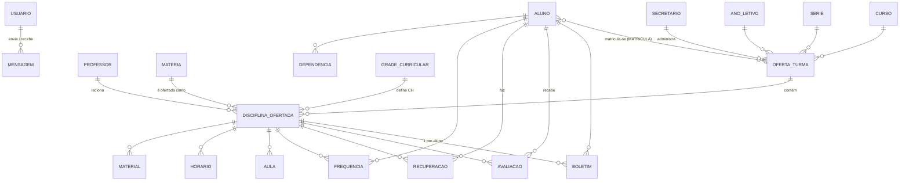
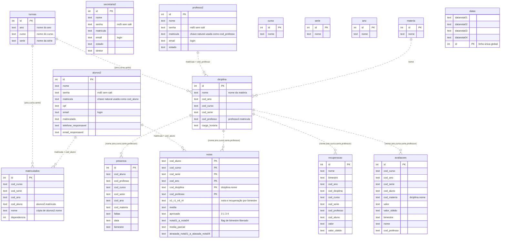

# Atena legado — MER e DER do banco

Modelo do banco **como o código fixado o usa** (`Cris042/Atena@ac48dc552b817233547104a5d0acba932d41ab91`,
PHP, 2024). É a entrada para a refatoração do banco descrita em
[`prompts/tarefas/refatoracao-banco.md`](../../prompts/tarefas/refatoracao-banco.md).

Convenção de confiabilidade usada em todo o documento:

- **[código]** — lido no código do commit fixado, com `arquivo:linha`;
- **[reconstruído]** — vem de `infra/legado/schema.sql` do Atena (commit `d4bce76`, posterior ao
  fixado), que reconstruiu o schema a partir do código; tipos ali são todos `text`, então tipo
  não é evidência;
- **[inferido]** — dedução deste documento, a confirmar.

## 1. Fontes e precedência

| Fonte | O que é | Uso |
|---|---|---|
| Código em `ac48dc5` | Única fonte de verdade sobre comportamento | precedência máxima |
| `infra/legado/schema.sql` (Atena `d4bce76`) | Schema reconstruído para PostgreSQL; ordem de colunas compatível com os `INSERT ... VALUES` posicionais | colunas e ordem |
| [`spec/legado/schema-mariadb-2020.ddl.sql`](../../spec/legado/schema-mariadb-2020.ddl.sql) | Dump MariaDB de 09/2020, **outra versão do sistema** (tabela única `user`, biblioteca, eventos) | só histórico e pista de tipos |

O dump de 2020 e o código fixado **não descrevem o mesmo banco**: das 25 tabelas usadas pelo código,
só `curso`, `materia`, `turmas`, `matriculados`, `notas` e `chat` existem no dump, e mesmo essas têm
colunas diferentes (ex.: `notas.idTurma/idAluno` × `notas.cod_*`). O MER abaixo segue o código.

## 2. MER — modelo conceitual (o que o sistema representa)

Entidades e papel na **fatia vertical** do experimento (notas, média, aprovação, autenticação por
perfil):

| Entidade | Tabela(s) legadas | Fatia? |
|---|---|---|
| Aluno, Professor, Secretário (perfis de usuário) | `alunos2`, `professo2`, `secretaria2` | **sim** (autenticação/autorização) |
| Oferta de turma (ano + curso + série) | `turmas`, `ano`, `curso`, `serie` | **sim** |
| Matrícula | `matriculados` | **sim** |
| Disciplina ofertada (matéria numa turma, com professor e CH) | `diciplina`, `materia` | **sim** |
| Boletim (notas bimestrais, recuperação, média, situação) | `notas` | **sim** |
| Avaliação e recuperação (lançamentos que compõem a nota) | `avaliacoes`, `recuperacao` | **sim** |
| Frequência (faltas — entram na aprovação) | `presenca` | **sim** |
| Prazos de lançamento por bimestre | `datas` | **sim** |
| Grade curricular | `grade_curricular`, `grade_curricular_padroes`, `grades_curricules` | parcial (CH) |
| Aula, horário, material, calendário, chat, unidade escolar, dependência | `aulas`, `horario`, `materiais`, `caledario`, `chat`, `unidade_escolar`, `dependencia` | não |

## 3. DER — modelo lógico do legado (como está)

Não existe **nenhuma chave estrangeira declarada**. Os vínculos são chaves naturais em texto
comparadas por igualdade nas queries; as linhas tracejadas (`..`) abaixo representam esses vínculos
implícitos.

Tabelas fora da fatia (colunas na ordem do INSERT, todas `text` salvo `id`): `aulas(id, data,
cod_professo, cod_serie, cod_ano, cod_curso, cod_materia, conteudo, aulas)`; `horario(id,
cod_professo, cod_diciplina, cod_curos*, cod_ano, cod_serie, data, horario, dia)`; `caledario(id,
tarefa, data)`; `chat(id, cod_remetente, cod_destino, mensagem, visualizado, data)`; `materiais(id,
nome, data, cod_professo, cod_ano, cod_materia, cod_curso, cod_serie, arquivo)`;
`unidade_escolar(id, nome, endereço, diretor, quantidade_aulas, minutos_aulas, telefone, cnpj)`;
`dependencia(id, cod_aluno, cod_diciplina)`; `grade_curricular(id, nome, cod_serie, cod_ano,
cod_curso, estado, ch)`; `grade_curricular_padroes(id, materia, ch, grade, nome)`;
`grades_curricules(id, nome)`. (*ver divergência D1.)

## 4. Evidências da fatia vertical

| Fato | Fonte |
|---|---|
| Login testa as três tabelas de perfil por `email + matricula + md5(senha)` | [código] `Models/HomeMolde.php:13-21` |
| Perfil vira flag de sessão (`login_Aluno`, `login_Professo`, `login_secretaria`) | [código] `Models/HomeMolde.php:28,44,67` |
| Token de sessão = `md5(matricula + IP + User-Agent)` | [código] `Models/HomeMolde.php:34,50` |
| `diciplina` é inserida como `(nome, ano, curso, serie, professor, carga_horaria)` | [código] `Models/MainMolde.php:396-397` |
| `cod_professo` recebe `professo2.matricula` (radio do formulário) | [código] `Views/pages/cadastrar-diciplina.php:95` |
| `matriculados` recebe `(curso, serie, ano, matricula_aluno, nome_aluno, 1)` | [código] `Models/MainMolde.php:428-435` |
| `notas` é inserida posicionalmente com 25 colunas e **sem `id`**, uma linha por aluno × disciplina | [código] `Models/MainMolde.php:519-520`, `Models/ajax/CadastroNotas.php:44-45` |
| Renomear disciplina é bloqueado se já houver avaliação, presença ou horário (porque o nome é chave) | [código] `Models/MainMolde.php:95-115` |
| Recuperação só substitui a nota do bimestre se `nota < 60` e `rec > nota`; notas > 100 viram 100; recuperação > 60 vira 60 | [código] `Models/ajax/CadastroNotas.php:55-165` |
| Média = soma das 4 notas efetivas / 4; `media_parcial` = soma / bimestres lançados | [código] `Models/ajax/CadastroNotas.php:172-173` |
| Faltas somadas de `presenca`; CH vem de `diciplina` (coluna 6) | [código] `Models/ajax/CadastroNotas.php:175-189` |
| Situação `aprovado`: `1` se média ≥ 60 com 4 bimestres; senão `3` se faltas×3300 > CH×3600×75%; senão `4` se média < 60 com 4 bimestres; senão `0` (cursando) | [código] `Models/ajax/CadastroNotas.php:191-198` |
| `UPDATE notas ... AND cod_aluno = $aluno[$i]` interpola valor no SQL | [código] `Models/ajax/CadastroNotas.php:201` |
| `nota0N = 1` e `atrasada_nota0N = 0` ao liberar o bimestre N | [código] `Models/MainMolde.php:449-484` (semântica exata [inferido]) |
| `datas` é uma linha global com o prazo de cada bimestre | [código] `Models/MainMolde.php:310-327` |

Códigos de domínio observados: `notas.aprovado ∈ {0 cursando, 1 aprovado, 3 reprovado por faltas,
4 reprovado}` [código]; `estado ∈ {0, 1}` em pessoas e grade [reconstruído].

> **Regra de faltas é suspeita, mas é o comportamento.** A condição reprova por faltas só quando
> as faltas (em aulas de 55 min) passam de **75%** da carga horária — o usual seria 25%. Como a
> média ≥ 60 é testada antes, um aluno com média ≥ 60 nunca é reprovado por faltas. O oráculo
> deve **caracterizar** isso; corrigir é decisão de negócio registrada, não escolha do agente.

## 5. Anomalias do modelo (insumo da refatoração)

| # | Anomalia | Consequência |
|---|---|---|
| A1 | Nenhuma FK, nenhum `UNIQUE` de negócio | órfãos e duplicatas possíveis (ex.: duas turmas iguais) |
| A2 | Chaves naturais **por nome** em texto (`cod_diciplina` = nome da matéria; turma = `ano+curso+serie` em texto) | renomear quebra vínculos; o código bloqueia renomeação em vez de resolver |
| A3 | Três tabelas de pessoa com as mesmas colunas (`alunos2`, `professo2`, `secretaria2`) | login em três queries; perfil vira tabela, não atributo |
| A4 | `notas` com grupo repetido por bimestre (`n1..n4`, `r1..r4`, `nota01..04`, `atrasada_*`) | 1FN violada; 4 bimestres fixos no schema |
| A5 | Dados derivados persistidos (`media`, `media_parcial`, `aprovado`) sem regra no banco | podem divergir das notas que os originam |
| A6 | Redundância: `matriculados.nome` copia `alunos2.nome`; `diciplina` repete `ano/curso/serie` da turma | anomalias de atualização |
| A7 | Todos os campos de negócio são texto (notas, datas, CH, faltas) | ordenação e comparação lexicográfica; sem validação de domínio |
| A8 | `datas` é tabela de linha única global | prazos não variam por ano letivo nem por turma |
| A9 | Senha em `md5` sem salt; e-mail e matrícula juntos como credencial | segurança (fora do MER, mas afeta o modelo de usuário) |
| A10 | Grafias com erro viraram contrato: `diciplina`, `professo2`, `caledario`, `atasada_nota04`, `cod_curos` | qualquer migração precisa de mapeamento explícito |
| A11 | Três tabelas de grade curricular sem relação declarada entre si | regra de CH espalhada |
| A12 | Dados pessoais de menores (CPF, filiação, responsáveis) sem separação | minimização/LGPD a decidir no modelo novo |

## 6. Divergências entre fontes (resolver antes de congelar)

| # | Divergência | Situação |
|---|---|---|
| D1 | O código usa `horario.cod_curos` em 41 queries (ex.: `Models/ajax/Horario.php:18`); o schema reconstruído declara `cod_curso` | o schema reconstruído **falha** com o código fixado; `horario` está fora da fatia |
| D2 | `alunos2.estado` e `alunos2.compat_estado_2024` existem só no schema reconstruído | acréscimos posteriores; ignorar no legado |
| D3 | `arquivo_privado` existe só no schema reconstruído | posterior ao commit fixado; ignorar |
| D4 | `secretaria2.diretor` e `alunos2.matriculado` não aparecem em nenhuma query extraída | [inferido] colunas mortas ou usadas via `SELECT *` |
| D5 | Dump 2020 × código 2024: modelos diferentes | dump não é usado para o oráculo |
| D6 | Tipo real das colunas de `notas` em 2024 é desconhecido; no dump de 2020 `media` era `INT`, o que arredondaria 75,25 para 75 | o dataset dourado usa texto e guarda o valor calculado pelo PHP (pendência P-10) |

## 6.1 Peculiaridades confirmadas executando o legado

Obtidas pelo dataset dourado (`oracle/dataset/notas-dourado.json`), que roda o endpoint real
`Models/ajax/CadastroNotas.php` em PHP 7.3 com casos sintéticos.

| # | Comportamento | Tratamento na reescrita |
|---|---|---|
| L1 | Média ≥ 60 com 4 bimestres aprova **antes** de olhar faltas (B12, B25–B27) | preservar (oráculo) |
| L2 | Nota vazia vale 0 na média e não conta na média parcial; nota `0` lançada conta (B10 × B11) | preservar (oráculo) |
| L3 | Recuperação sem nota no bimestre é ignorada (B21) | preservar (oráculo) |
| L4 | A carga horária usada é a da **primeira** disciplina do professor na turma, não a da disciplina lançada (`CadastroNotas.php:176-177`) | não reproduzir; o dourado usa uma disciplina por professor por turma |
| L5 | A situação só é recalculada quando o professor salva as notas; faltas lançadas depois não mudam a situação gravada | não reproduzir; a situação reflete os dados atuais |
| L6 | `UPDATE … cod_aluno = $aluno[$i]` sem aspas: matrícula não numérica gera erro de SQL | não reproduzir (é a injeção de SQL da linha 201) |

## 7. Como este documento foi produzido

Extração automática das queries SQL do commit fixado (tabela → colunas → `arquivo:linha`), cruzada
com o schema reconstruído e com leitura manual dos fluxos da fatia. O script de extração deve virar
parte do pipeline de RAG (etapa 4), para que este documento possa ser regenerado e conferido.
